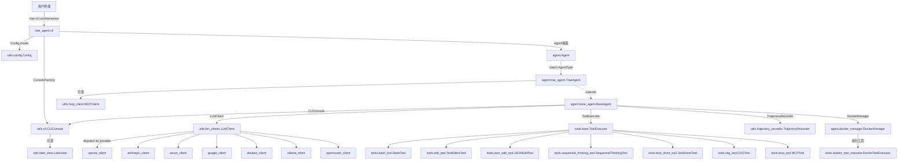
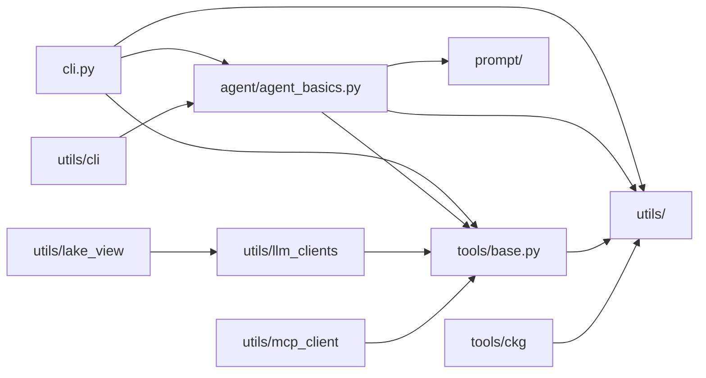

# Trae Agent Code Wiki

> 本文档基于 GitHub 仓库 [bytedance/trae-agent](https://github.com/bytedance/trae-agent) `main` 分支（截至 2026-02-05 的最新提交）生成，用于系统性梳理 Trae Agent 的项目结构、架构设计、模块职责、核心接口与运行方式。

---

## 1. 项目概述

### 1.1 项目定位与核心价值

**Trae Agent** 是由字节跳动 Trae Research Team 开发的 **LLM-based Agent**，专注于**通用软件工程任务**（general purpose software engineering tasks）。它通过 CLI 接口接受自然语言指令，借助多种 LLM 提供商与丰富的工具生态，自动完成代码编写、调试、重构、测试等复杂工作流。

核心价值在于：

- **透明可改的模块化架构**：与其他 CLI Agent（如 Aider、OpenDevin、SWE-agent）相比，Trae Agent 强调"研究友好"（research-friendly design），便于研究者进行 **agent 架构研究、消融实验、新 agent 能力开发**。
- **多 LLM 提供商支持**：开箱即用支持 OpenAI、Anthropic、Doubao（豆包）、Azure、OpenRouter、Ollama、Google Gemini。
- **Lakeview 摘要机制**：为每一步 agent 行为生成简短摘要与语义标签，便于轨迹分析与可视化。
- **完整轨迹记录**：自动记录 LLM 交互、工具调用、token 使用等，便于调试与回放。
- **Docker 沙箱模式**：支持在隔离容器内执行任务，提升安全性。

### 1.2 仓库基本信息

| 属性 | 值 |
| --- | --- |
| 仓库名称 | `bytedance/trae-agent` |
| License | MIT |
| 主要语言 | Python（99.4%） |
| Python 版本要求 | ≥ 3.12 |
| 构建系统 | hatchling |
| 包管理工具 | [uv](https://docs.astral.sh/uv/) |
| 最新提交 | `e839e55`（2026-02-05，fix(openai): persist tool outputs in message history） |
| Commit 数（截至抓取时） | 289 |
| Issues | 96 open |
| Pull Requests | 47 open |
| 技术报告 | [arXiv:2507.23370](https://arxiv.org/abs/2507.23370) |
| 社区 | [Discord](https://discord.gg/VwaQ4ZBHvC) |
| CI | pre-commit + unit-test GitHub Actions |

### 1.3 项目背景与解决的问题

Trae Agent 的设计动机来自学术界与工业界对 **AI Agent 软件工程能力研究**的迫切需求：

- 现有 CLI Agent 多为黑盒实现，难以拆解分析其推理链、工具调用策略与失败模式。
- 评测社区（如 SWE-bench）需要可复现、可定制的 agent 框架以对比不同 LLM、不同提示策略、不同工具组合的效果。
- 字节跳动内部研究团队需要一个能集成豆包等国产模型的实验平台。

Trae Agent 通过**配置驱动的多 LLM 接入**、**完整的 trajectory 落盘**、**可插拔的工具注册表**、**Lakeview 自动摘要**等机制，回应了上述需求，并提供了 Docker 沙箱与 HTTP Server（规划中）等扩展能力。

---

## 2. 项目整体架构

### 2.1 顶层目录结构

```text
trae-agent/
├── .github/                  # GitHub Actions workflows（pre-commit、unit-test）
├── .vscode/                  # VSCode 调试配置模板
├── docs/                     # 项目文档
│   ├── TRAJECTORY_RECORDING.md
│   ├── legacy_config.md
│   ├── roadmap.md
│   └── tools.md
├── evaluation/               # 评测脚本（SWE-bench / swebench-live / multi-swebench）
├── server/                   # HTTP Server（基于 FastAPI，规划中）
├── tests/                    # 单元测试
│   ├── agent/
│   ├── tools/
│   ├── utils/
│   └── test_cli.py
├── trae_agent/               # 核心源码包
│   ├── agent/                # Agent 层（Agent、BaseAgent、TraeAgent、DockerManager）
│   ├── dist/                 # PyInstaller 打包后的工具二进制（Docker 模式使用）
│   │   └── dist_tools/
│   ├── prompt/               # 系统提示词模板
│   ├── tools/                # 工具生态（bash、edit、json_edit、sequentialthinking 等）
│   │   └── ckg/              # Code Knowledge Graph 工具子模块
│   ├── utils/                # 工具与基础设施
│   │   ├── cli/              # CLI 控制台（simple / rich 两种实现）
│   │   ├── llm_clients/      # LLM 客户端（多 provider 实现）
│   │   ├── config.py         # YAML/JSON 配置加载
│   │   ├── constants.py
│   │   ├── lake_view.py      # Lakeview 摘要引擎
│   │   ├── legacy_config.py  # 旧版 JSON 配置兼容
│   │   ├── mcp_client.py     # MCP 协议客户端
│   │   └── trajectory_recorder.py
│   ├── __init__.py
│   └── cli.py                # CLI 入口（trae-cli 命令）
├── .gitignore
├── .pre-commit-config.yaml
├── .python-version           # 3.12
├── CONTRIBUTING.md
├── LICENSE
├── Makefile                  # 开发命令集合
├── README.md
├── pyproject.toml            # 项目元数据与依赖
├── trae_config.json.example  # 旧版 JSON 配置示例
├── trae_config.yaml.example  # 推荐 YAML 配置示例
└── uv.lock
```

### 2.2 架构分层

Trae Agent 采用清晰的分层架构，自上而下分为四层：

| 层级 | 路径 | 职责 |
| --- | --- | --- |
| **CLI 层** | `trae_agent/cli.py` | 命令解析（click）、配置加载、参数校验、Docker 预检、Agent 装配 |
| **Agent 层** | `trae_agent/agent/` | Agent 生命周期、ReAct 循环、任务编排、Docker 协调、MCP 集成 |
| **Tool 层** | `trae_agent/tools/` | 工具基类、注册表、具体工具实现、Docker 工具执行器 |
| **基础设施层** | `trae_agent/utils/` | LLM 客户端、配置管理、CLI 控制台、Lakeview、Trajectory 记录、MCP 客户端 |

### 2.3 模块间调用关系图



### 2.4 关键设计模式与架构决策

1. **策略模式 + 工厂方法（LLM 客户端）**：`LLMClient` 通过 `match self.provider` 在构造期分发到具体 provider 子类，调用方只依赖 `BaseLLMClient` 抽象接口。
2. **模板方法（BaseAgent.execute_task）**：基类定义 ReAct 主循环（think → call tool → reflect → finalize），子类覆写 `new_task` / `llm_indicates_task_completed` / `reflect_on_result` 等钩子。
3. **注册表模式（工具生态）**：`tools_registry: dict[str, type[Tool]]` 在 `tools/__init__.py` 中集中注册，配置文件中的 `tools: [...]` 列表通过名称查找对应类。
4. **装饰器模式（DockerToolExecutor）**：包装原始 `ToolExecutor`，将 `bash` / `str_replace_based_edit_tool` / `json_edit_tool` 三类工具的执行转发到容器内的二进制，其他工具仍走本地路径。
5. **配置优先级链**：CLI 参数 > 配置文件 > 环境变量 > 默认值，由 `resolve_config_value()` 统一处理。
6. **轨迹即审计**：`TrajectoryRecorder` 在每次 LLM 调用与 agent step 后立即落盘（`save_trajectory()`），即使后续崩溃也能保留前序记录。
7. **MCP 集成可选化**：通过 `mcp_servers` 与 `allow_mcp_servers` 两个配置项解耦"定义"与"启用"，连接失败不影响主流程。

---

## 3. 主要模块职责

### 3.1 `trae_agent.cli` — CLI 入口层

- **路径**：`trae_agent/cli.py`
- **核心职责**：
  - 使用 `click` 定义命令组 `cli`，提供 `run` / `interactive` / `show-config` 等子命令。
  - 处理配置文件兼容（YAML → JSON 回退，调用 `resolve_config_file`）。
  - 解析 Docker 模式参数（`--docker-image` / `--docker-container-id` / `--dockerfile-path` / `--docker-image-file`），并通过 `check_docker()` 预检 Docker 环境。
  - 装配 `Config`、`CLIConsole`、`Agent`，并通过 `asyncio.run(agent.run(...))` 启动任务。
  - 首次进入 Docker 模式时调用 `build_with_pyinstaller()` 编译 `edit_tool` 与 `json_edit_tool` 为独立二进制（供容器内调用）。
- **对外暴露**：`main`（被 `pyproject.toml` 注册为 `trae-cli` 控制台脚本入口）。
- **依赖**：`trae_agent.agent.Agent`、`trae_agent.utils.config.Config`、`trae_agent.utils.cli`。

### 3.2 `trae_agent.agent` — Agent 层

| 文件 | 职责 |
| --- | --- |
| `agent.py` | 顶层 `Agent` 门面类，根据 `AgentType` 实例化具体 agent，统一管理 trajectory 与 MCP 生命周期。 |
| `base_agent.py` | 抽象基类 `BaseAgent`，实现 ReAct 主循环、工具调用分发、Docker 装配、token 统计。 |
| `trae_agent.py` | `TraeAgent`：默认 agent 实现，定义软件工程默认工具集、系统提示、git diff 生成、MCP 发现。 |
| `agent_basics.py` | 数据类定义：`AgentStep`、`AgentExecution`、`AgentState`、`AgentStepState`、`AgentError`。 |
| `docker_manager.py` | `DockerManager`：容器生命周期管理、镜像构建/加载、workspace 挂载、shell 启动。 |

- **对外暴露**：`Agent`（门面）、`BaseAgent`（可继承扩展）、`TraeAgent`（默认实现）。
- **依赖**：`trae_agent.tools`、`trae_agent.utils.llm_clients`、`trae_agent.utils.config`、`trae_agent.utils.trajectory_recorder`、`trae_agent.utils.cli`、`trae_agent.utils.mcp_client`、`trae_agent.prompt`。

### 3.3 `trae_agent.tools` — Tool 层

- **路径**：`trae_agent/tools/`
- **核心职责**：定义工具基类、注册表、具体工具实现，以及 Docker 模式下的工具执行代理。
- **对外暴露**（见 `__init__.py`）：

  ```python
  tools_registry: dict[str, type[Tool]] = {
      "bash": BashTool,
      "str_replace_based_edit_tool": TextEditorTool,
      "json_edit_tool": JSONEditTool,
      "sequentialthinking": SequentialThinkingTool,
      "task_done": TaskDoneTool,
      "ckg": CKGTool,
  }
  ```

- **文件清单**：

  | 文件 | 工具名 | 功能 |
  | --- | --- | --- |
  | `base.py` | — | `Tool` / `ToolExecutor` / `ToolCall` / `ToolResult` 抽象基类与执行器 |
  | `bash_tool.py` | `bash` | 持久化 shell 会话执行命令，120s 超时 |
  | `edit_tool.py` | `str_replace_based_edit_tool` | 文件查看 / 创建 / 字符串精确替换 / 行插入 |
  | `edit_tool_cli.py` | — | PyInstaller 打包入口（Docker 模式用） |
  | `json_edit_tool.py` | `json_edit_tool` | 基于 JSONPath 的 JSON 文件精确编辑 |
  | `json_edit_tool_cli.py` | — | PyInstaller 打包入口 |
  | `sequential_thinking_tool.py` | `sequentialthinking` | 结构化分步推理，支持分支与回溯 |
  | `task_done_tool.py` | `task_done` | 显式标记任务完成信号 |
  | `ckg_tool.py` | `ckg` | Code Knowledge Graph，多语言代码分析（依赖 `ckg/` 子模块） |
  | `mcp_tool.py` | — | MCP 工具适配器，将 MCP server 暴露的能力包装为 `Tool` |
  | `docker_tool_executor.py` | — | `DockerToolExecutor`：将工具调用转发至容器内执行 |
  | `run.py` | — | 工具调试入口 |

- **依赖**：`trae_agent.utils.llm_clients`（仅用作 `model_provider` 元信息，决定 schema 严格度）。

### 3.4 `trae_agent.utils` — 基础设施层

| 子模块 | 路径 | 职责 |
| --- | --- | --- |
| `config.py` | `utils/config.py` | YAML/JSON 配置解析，`Config` / `TraeAgentConfig` / `ModelConfig` / `ModelProvider` / `MCPServerConfig` / `LakeviewConfig` 数据类 |
| `legacy_config.py` | `utils/legacy_config.py` | 旧版 JSON 配置兼容层 |
| `trajectory_recorder.py` | `utils/trajectory_recorder.py` | 轨迹记录器，JSON 落盘，记录 LLM 交互、agent step、token 使用 |
| `lake_view.py` | `utils/lake_view.py` | Lakeview 摘要引擎，使用单独 LLM 为每一步生成 `<task>` / `<details>` 与语义标签 |
| `mcp_client.py` | `utils/mcp_client.py` | MCP 协议客户端，连接 stdio/SSE/HTTP/WebSocket 多种传输 |
| `constants.py` | `utils/constants.py` | 全局常量 |
| `cli/` | `utils/cli/` | CLI 控制台：`CLIConsole` 抽象基类、`SimpleCLIConsole`、`RichCLIConsole`、`ConsoleFactory` |
| `llm_clients/` | `utils/llm_clients/` | LLM 客户端：`LLMClient` 门面 + 7 个 provider 子客户端 + `BaseLLMClient` 抽象基类 + `openai_compatible_base` 共享实现 |

#### 3.4.1 `utils.llm_clients` 文件清单

| 文件 | 大小 | 角色 |
| --- | --- | --- |
| `base_client.py` | 1.5 KB | `BaseLLMClient` 抽象基类 |
| `llm_client.py` | 3.1 KB | `LLMClient` 门面 + `LLMProvider` 枚举 |
| `llm_basics.py` | 1.6 KB | `LLMMessage` / `LLMResponse` / `LLMUsage` 数据类 |
| `openai_compatible_base.py` | 10.6 KB | OpenAI 兼容协议共享实现（被 OpenAI / Doubao / OpenRouter 复用） |
| `openai_client.py` | 8.1 KB | OpenAI 客户端 |
| `anthropic_client.py` | 8.6 KB | Anthropic 客户端 |
| `azure_client.py` | 1.6 KB | Azure OpenAI 客户端 |
| `google_client.py` | 9.1 KB | Google Gemini 客户端 |
| `ollama_client.py` | 6.9 KB | Ollama 本地模型客户端 |
| `doubao_client.py` | 1.5 KB | 豆包（火山方舟）客户端 |
| `openrouter_client.py` | 2.5 KB | OpenRouter 客户端 |
| `retry_utils.py` | 1.6 KB | 重试工具 |
| `readme.md` | 93 B | 模块说明占位 |

### 3.5 `trae_agent.prompt` — 提示词

- **路径**：`trae_agent/prompt/`
- **职责**：集中存放各 agent 的系统提示词（如 `TRAE_AGENT_SYSTEM_PROMPT`），与代码解耦。

### 3.6 `docs/` — 项目文档

| 文件 | 内容 |
| --- | --- |
| `tools.md` | 内置工具详细说明（操作、参数、示例） |
| `TRAJECTORY_RECORDING.md` | 轨迹文件结构、字段说明、回放方法 |
| `roadmap.md` | 项目路线图：SDK、沙箱、轨迹分析、MCP、多 agent |
| `legacy_config.md` | 旧版 JSON 配置迁移指南 |

### 3.7 `evaluation/` — 评测

- **路径**：`evaluation/`
- **职责**：集成 SWE-bench、swebench-live、multi-swebench 评测脚本，需安装 `evaluation` 可选依赖组（`docker` / `pexpect` / `unidiff` / `datasets`）。

### 3.8 `server/` — HTTP Server（规划中）

- **路径**：`server/`
- **状态**：基于 FastAPI，**仍在开发中，不可用于生产**。
- **目标**：stateless 操作、并发请求处理、JSON 流式响应、轨迹回放。

### 3.9 `tests/` — 测试

- **路径**：`tests/`
- **结构**：`test_cli.py`、`tests/agent/`、`tests/tools/`、`tests/utils/`。
- **配置**：`asyncio_mode = "auto"`，标记 `slow` / `integration` / `unit`。

---

## 4. 关键类与函数说明

### 4.1 `Agent`（门面）

- **文件**：`trae_agent/agent/agent.py`
- **签名**：

  ```python
  class Agent:
      def __init__(
          self,
          agent_type: AgentType | str,
          config: Config,
          trajectory_file: str | None = None,
          cli_console: CLIConsole | None = None,
          docker_config: dict | None = None,
          docker_keep: bool = True,
      ): ...

      async def run(
          self,
          task: str,
          extra_args: dict[str, str] | None = None,
          tool_names: list[str] | None = None,
      ): ...
  ```

- **功能**：根据 `agent_type` 实例化具体 agent（当前仅 `TraeAgent`），初始化 `TrajectoryRecorder`，启动 MCP 工具发现，调用 `agent.execute_task()`，并在结束时清理 MCP 客户端。
- **使用示例**：

  ```python
  agent = Agent("trae_agent", config, trajectory_file="debug.json", cli_console=console)
  await agent.run("Fix the bug in main.py", extra_args={"project_path": "/repo", "issue": "..."})
  ```

### 4.2 `BaseAgent`（抽象基类）

- **文件**：`trae_agent/agent/base_agent.py`
- **核心方法**：
  - `__init__(agent_config, docker_config=None, docker_keep=True)`：装配 LLM 客户端、工具列表、`ToolExecutor` 或 `DockerToolExecutor`，并清理旧的 CKG 数据库。
  - `async execute_task() -> AgentExecution`：ReAct 主循环，最多 `_max_steps` 步。
  - `async _run_llm_step(step, messages, execution) -> list[LLMMessage]`：单步 LLM 调用 + 完成判定 + 工具分发。
  - `async _tool_call_handler(tool_calls, step) -> list[LLMMessage]`：并行或串行执行工具，附加 reflection。
  - `reflect_on_result(tool_results) -> str | None`：失败工具调用的反思文本（默认实现）。
  - `llm_indicates_task_completed(llm_response) -> bool`：基于关键词的完成判定（可覆写）。

### 4.3 `TraeAgent`（默认实现）

- **文件**：`trae_agent/agent/trae_agent.py`
- **关键覆写**：
  - `new_task(task, extra_args, tool_names=None)`：构造 system prompt + 用户消息（包含 `[Project root path]` 与 `[Problem statement]`），启动 trajectory 记录。
  - `execute_task()`：调用父类后，写入 patch 文件（若 `patch_path` 设置）并 finalize trajectory。
  - `llm_indicates_task_completed(llm_response)`：检测 `tool_calls` 中是否包含 `task_done`。
  - `_is_task_completed(llm_response)`：若 `must_patch="true"`，验证 git diff 非空且已过滤测试目录改动。
  - `get_git_diff() -> str`：调用 `git --no-pager diff` 生成补丁。
  - `remove_patches_to_tests(model_patch) -> str`：从补丁中移除对 `test/` 目录的改动（源自 Aider-swe-bench，Apache-2.0）。
  - `async initialise_mcp()` / `async discover_mcp_tools()` / `async cleanup_mcp_clients()`：MCP 生命周期管理。

### 4.4 `LLMClient`（门面）

- **文件**：`trae_agent/utils/llm_clients/llm_client.py`
- **签名**：

  ```python
  class LLMClient:
      def __init__(self, model_config: ModelConfig): ...
      def chat(
          self,
          messages: list[LLMMessage],
          model_config: ModelConfig,
          tools: list[Tool] | None = None,
          reuse_history: bool = True,
      ) -> LLMResponse: ...
  ```

- **功能**：根据 `model_config.model_provider.provider` 在构造期通过 `match` 分发到具体 `BaseLLMClient` 子类。对外只暴露 `chat` / `set_chat_history` / `set_trajectory_recorder` / `supports_tool_calling`。

### 4.5 `BaseLLMClient`（抽象基类）

- **文件**：`trae_agent/utils/llm_clients/base_client.py`
- **抽象方法**：`set_chat_history(messages)`、`chat(messages, model_config, tools, reuse_history) -> LLMResponse`。
- **默认实现**：`supports_tool_calling(model_config)` 返回 `model_config.supports_tool_calling`。

### 4.6 `Tool`（工具基类）

- **文件**：`trae_agent/tools/base.py`
- **签名**：

  ```python
  class Tool(ABC):
      def __init__(self, model_provider: str | None = None): ...
      @abstractmethod
      def get_name(self) -> str: ...
      @abstractmethod
      def get_description(self) -> str: ...
      @abstractmethod
      def get_parameters(self) -> list[ToolParameter]: ...
      @abstractmethod
      async def execute(self, arguments: ToolCallArguments) -> ToolExecResult: ...
      def json_definition(self) -> dict[str, object]: ...
      def get_input_schema(self) -> dict[str, object]: ...
  ```

- **关键设计**：`name` / `description` / `parameters` 均为 `cached_property`，由抽象方法惰性计算；`get_input_schema()` 根据 `model_provider` 自动适配 OpenAI strict 模式（所有参数入 `required` + `additionalProperties: false`）。

### 4.7 `ToolExecutor` / `DockerToolExecutor`

- **文件**：`trae_agent/tools/base.py`、`trae_agent/tools/docker_tool_executor.py`
- **职责**：
  - `ToolExecutor`：维护 `name → Tool` 字典（名称归一化为小写去下划线），提供 `parallel_tool_call` / `sequential_tool_call` / `execute_tool_call` / `close_tools`。
  - `DockerToolExecutor`：包装 `ToolExecutor`，对 `["bash", "str_replace_based_edit_tool", "json_edit_tool"]` 三类工具调用转发到容器内执行（通过 `DockerManager` 调用打包好的二进制），其他工具仍走本地。

### 4.8 `Config`（配置加载器）

- **文件**：`trae_agent/utils/config.py`
- **关键方法**：
  - `classmethod create(*, config_file=None, config_string=None) -> Config`：解析 YAML，构造 `ModelProvider` / `ModelConfig` / `TraeAgentConfig` / `LakeviewConfig`。
  - `classmethod create_from_legacy_config(...)`：从旧版 JSON 配置迁移。
  - `resolve_config_values(*, provider, model, model_base_url, api_key, max_steps)`：用 CLI/环境变量覆盖配置值。
- **数据类**：`ModelProvider` / `ModelConfig` / `AgentConfig` / `TraeAgentConfig` / `LakeviewConfig` / `MCPServerConfig`。

### 4.9 `TrajectoryRecorder`

- **文件**：`trae_agent/utils/trajectory_recorder.py`
- **关键方法**：
  - `start_recording(task, provider, model, max_steps)`：初始化元数据并落盘。
  - `record_llm_interaction(messages, response, provider, model, tools)`：记录单次 LLM 调用（含 token 使用、tool_calls）。
  - `record_agent_step(step_number, state, llm_messages, llm_response, tool_calls, tool_results, reflection, error)`：记录 agent step。
  - `update_lakeview(step_number, lakeview_summary)`：附加 Lakeview 摘要。
  - `finalize_recording(success, final_result)`：写入结束时间与执行耗时。
  - `save_trajectory()`：每次调用后立即写盘，确保崩溃可恢复。

### 4.10 `LakeView`

- **文件**：`trae_agent/utils/lake_view.py`
- **职责**：使用独立的 LLM（`LakeviewConfig.model`）为每个 agent step 生成：
  - `<task>` 简短概括（≤10 词）
  - `<details>` 缺陷特定细节（≤30 词）
  - 语义标签：`WRITE_TEST` / `VERIFY_TEST` / `EXAMINE_CODE` / `WRITE_FIX` / `VERIFY_FIX` / `REPORT` / `THINK` / `OUTLIER`
- **关键方法**：`async create_lakeview_step(agent_step) -> LakeViewStep | None`、`extract_task_in_step(prev, this)`、`extract_tag_in_step(step)`。

### 4.11 `DockerManager`

- **文件**：`trae_agent/agent/docker_manager.py`
- **职责**：管理容器生命周期（构建/加载/attach）、挂载 workspace、拷贝工具二进制到 `/agent_tools`、启动持久 shell（基于 `pexpect`）。
- **常量**：`CONTAINER_TOOLS_PATH = "/agent_tools"`，`container_workspace = "/workspace"`。

### 4.12 `MCPClient`

- **文件**：`trae_agent/utils/mcp_client.py`
- **职责**：实现 Model Context Protocol 客户端，支持 stdio / SSE / streamable HTTP / WebSocket 四种传输；连接后自动发现远端工具并包装为 `Tool` 实例追加到 agent 的工具列表。

### 4.13 `CLIConsole`（抽象基类）及实现

- **文件**：`trae_agent/utils/cli/cli_console.py`
- **抽象方法**：`start()` / `update_status(step, execution)` / `print_task_details(details)` / `print(msg, color, bold)` / `get_task_input()` / `get_working_dir_input()` / `stop()`。
- **枚举**：`ConsoleMode.RUN` / `ConsoleMode.INTERACTIVE`；`ConsoleType.SIMPLE` / `ConsoleType.RICH`。
- **工厂**：`ConsoleFactory.create_console(console_type, mode)`。
- **辅助**：`generate_agent_step_table(agent_step) -> rich.table.Table`，将 step 渲染为带 emoji 的表格。

### 4.14 `run`（CLI 主命令）

- **文件**：`trae_agent/cli.py`
- **签名**：

  ```python
  @cli.command()
  @click.argument("task", required=False)
  @click.option("--file", "-f", "file_path", ...)
  @click.option("--provider", "-p", ...)
  @click.option("--model", "-m", ...)
  @click.option("--working-dir", "-w", ...)
  @click.option("--must-patch", "-mp", is_flag=True, ...)
  @click.option("--config-file", default="trae_config.yaml", envvar="TRAE_CONFIG_FILE")
  @click.option("--trajectory-file", "-t", ...)
  @click.option("--docker-image", ...)
  @click.option("--docker-container-id", ...)
  @click.option("--dockerfile-path", ...)
  @click.option("--docker-image-file", ...)
  @click.option("--docker-keep", type=bool, default=True, ...)
  @click.option("--console-type", "-ct", type=click.Choice(["simple", "rich"]), default="simple")
  @click.option("--agent-type", "-at", default="trae_agent")
  def run(task, file_path, patch_path, provider, model, ...): ...
  ```

- **功能**：CLI 入口，校验 Docker 参数互斥性、解析配置、装配 agent 并启动 `asyncio.run(agent.run(...))`，捕获 `KeyboardInterrupt` 与 `DockerException`。

### 4.15 数据类家族（`agent_basics.py` / `llm_basics.py`）

| 类 | 文件 | 说明 |
| --- | --- | --- |
| `AgentStep` | `agent/agent_basics.py` | 单步记录：`step_number` / `state` / `tool_calls` / `tool_results` / `llm_response` / `reflection` / `error` |
| `AgentExecution` | `agent/agent_basics.py` | 整体执行：`task` / `steps[]` / `final_result` / `success` / `total_tokens` / `execution_time` |
| `AgentState` | `agent/agent_basics.py` | `IDLE` / `RUNNING` / `COMPLETED` / `ERROR` |
| `AgentStepState` | `agent/agent_basics.py` | `THINKING` / `CALLING_TOOL` / `REFLECTING` / `COMPLETED` / `ERROR` |
| `LLMMessage` | `utils/llm_clients/llm_basics.py` | `role` / `content` / `tool_call` / `tool_result` |
| `LLMResponse` | `utils/llm_clients/llm_basics.py` | `content` / `usage` / `model` / `finish_reason` / `tool_calls` |
| `LLMUsage` | `utils/llm_clients/llm_basics.py` | token 计数，支持 `__add__` 累加 |
| `ToolCall` / `ToolResult` / `ToolExecResult` | `tools/base.py` | 工具调用与结果 |

---

## 5. 依赖关系

### 5.1 运行时依赖（`pyproject.toml [project.dependencies]`）

| 依赖 | 版本约束 | 用途 |
| --- | --- | --- |
| `openai` | `>=1.86.0` | OpenAI / OpenRouter / Doubao 客户端 |
| `anthropic` | `>=0.54.0,<=0.60.0` | Anthropic Claude 客户端 |
| `google-genai` | `>=1.24.0` | Google Gemini 客户端 |
| `ollama` | `>=0.5.1` | Ollama 本地模型客户端 |
| `click` / `asyncclick` | `>=8.0.0` | CLI 框架 |
| `pydantic` | `>=2.0.0` | 数据校验 |
| `pyyaml` | `>=6.0.2` | YAML 配置解析 |
| `python-dotenv` | `>=1.0.0` | `.env` 加载 |
| `rich` | `>=13.0.0` | 终端富文本渲染 |
| `textual` | `>=0.50.0` | TUI（Rich console） |
| `jsonpath-ng` | `>=1.7.0` | JSON 编辑工具的 JSONPath 解析 |
| `tree-sitter` | `==0.21.3` | 代码解析（CKG 工具） |
| `tree-sitter-languages` | `==1.10.2` | 多语言 tree-sitter 支持 |
| `mcp` | `==1.12.2` | Model Context Protocol 客户端 |
| `socksio` | `>=1.0.0` | SOCKS 代理支持 |
| `typing-extensions` | `>=4.0.0` | 类型扩展 |
| `ruff` | `>=0.12.4` | 代码风格（运行时也安装） |
| `pyinstaller` | `==6.15.0` | Docker 模式工具二进制打包 |

### 5.2 可选依赖

| 组 | 依赖 | 用途 |
| --- | --- | --- |
| `test` | `pytest` / `pytest-asyncio` / `pytest-mock` / `pytest-cov` / `pre-commit` | 测试与提交前钩子 |
| `evaluation` | `datasets` / `docker` / `pexpect` / `unidiff` | SWE-bench 评测 |
| `dev` | `types-pyyaml` | YAML 类型 stub |

### 5.3 内部模块依赖图



### 5.4 外部服务依赖

| 服务 | 用途 | 必需性 |
| --- | --- | --- |
| LLM Provider API | LLM 推理 | 必需（至少一个） |
| 文件系统 | 代码读写、trajectory 落盘、配置加载 | 必需 |
| Shell（bash） | `bash` 工具执行命令 | 必需 |
| Git | `TraeAgent.get_git_diff()` 生成补丁 | 任务产出 patch 时必需 |
| Docker daemon | Docker 沙箱模式 | 仅 Docker 模式 |
| PyInstaller | Docker 模式首次构建工具二进制 | 仅 Docker 模式首次 |
| MCP server（如 Playwright） | 浏览器自动化等扩展能力 | 可选 |
| npm/npx | MCP server 启动（如 `@playwright/mcp`） | 可选 |

---

## 6. 项目运行方式

### 6.1 环境要求

- **Python**：≥ 3.12（`.python-version` 锁定 3.12）
- **包管理**：[uv](https://docs.astral.sh/uv/)（推荐）
- **操作系统**：跨平台，但 Docker 模式在 Windows 上对 `BashTool._process.stop()` 有热修复（PR #297）
- **API Key**：至少一个 LLM 提供商的凭证

### 6.2 安装步骤

```bash
# 1. 克隆仓库
git clone https://github.com/bytedance/trae-agent.git
cd trae-agent

# 2. 同步全部依赖（含 test / evaluation 可选组）
uv sync --all-extras

# 3. 激活虚拟环境
source .venv/bin/activate    # macOS/Linux
# .venv\Scripts\activate     # Windows PowerShell

# 4. 复制配置模板
cp trae_config.yaml.example trae_config.yaml
```

### 6.3 配置说明

#### 6.3.1 YAML 配置（推荐）

`trae_config.yaml` 的完整结构（参考 `trae_config.yaml.example`）：

```yaml
agents:
  trae_agent:
    enable_lakeview: true
    model: trae_agent_model          # 引用 models 段的 key
    max_steps: 200
    tools:
      - bash
      - str_replace_based_edit_tool
      - sequentialthinking
      - task_done

allow_mcp_servers:                   # 允许启用的 MCP server 名单
  - playwright

mcp_servers:                         # MCP server 定义
  playwright:
    command: npx
    args:
      - "@playwright/mcp@0.0.27"

lakeview:                            # Lakeview 单独使用一个模型
  model: lakeview_model

model_providers:                     # provider 凭证
  anthropic:
    api_key: your_anthropic_api_key
    provider: anthropic
  openai:
    api_key: your_openai_api_key
    provider: openai
    base_url: https://api.openai.com/v1   # 可选

models:                              # 模型定义
  trae_agent_model:
    model_provider: anthropic
    model: claude-4-sonnet
    max_tokens: 4096
    temperature: 0.5
    top_p: 1
    top_k: 0
    max_retries: 10
    parallel_tool_calls: true
  lakeview_model:
    model_provider: anthropic
    model: claude-3.5-sonnet
    max_tokens: 4096
    temperature: 0.5
    top_p: 1
    top_k: 0
    max_retries: 10
    parallel_tool_calls: true
```

> **注意**：YAML 中只允许使用空格缩进，禁止 Tab。

#### 6.3.2 环境变量（备选）

```bash
export OPENAI_API_KEY="your-openai-api-key"
export OPENAI_BASE_URL="your-openai-base-url"
export ANTHROPIC_API_KEY="your-anthropic-api-key"
export ANTHROPIC_BASE_URL="your-anthropic-base-url"
export GOOGLE_API_KEY="your-google-api-key"
export GOOGLE_BASE_URL="your-google-base-url"
export OPENROUTER_API_KEY="your-openrouter-api-key"
export OPENROUTER_BASE_URL="https://openrouter.ai/api/v1"
export DOUBAO_API_KEY="your-doubao-api-key"
export DOUBAO_BASE_URL="https://ark.cn-beijing.volces.com/api/v3/"
```

也可写入 `.env` 文件，由 `python-dotenv` 自动加载。

#### 6.3.3 配置优先级

```
CLI 参数  >  配置文件 (trae_config.yaml)  >  环境变量  >  默认值
```

由 `trae_agent/utils/config.py::resolve_config_value()` 统一实现。

#### 6.3.4 旧版 JSON 配置

详见 `docs/legacy_config.md`，`Config.create()` 检测到 `.json` 后缀会自动走 `create_from_legacy_config` 路径，建议迁移至 YAML。

### 6.4 启动命令与常用 CLI 参数

```bash
# 简单任务执行
trae-cli run "Create a hello world Python script"

# 查看当前生效配置
trae-cli show-config

# 交互模式
trae-cli interactive
```

#### 6.4.1 `run` 子命令常用参数

| 参数 | 缩写 | 说明 |
| --- | --- | --- |
| `--file` | `-f` | 从文件读取任务描述（与 `task` 互斥） |
| `--provider` | `-p` | LLM provider（覆盖配置） |
| `--model` | `-m` | 模型名（覆盖配置） |
| `--model-base-url` | — | API base URL |
| `--api-key` | `-k` | API key |
| `--max-steps` | — | 最大执行步数 |
| `--working-dir` | `-w` | 工作目录（必须为绝对路径） |
| `--must-patch` | `-mp` | 强制要求生成非空 patch |
| `--config-file` | — | 配置文件路径，默认 `trae_config.yaml`，支持环境变量 `TRAE_CONFIG_FILE` |
| `--trajectory-file` | `-t` | 轨迹文件输出路径 |
| `--patch-path` | `-pp` | patch 文件输出路径 |
| `--docker-image` | — | Docker 模式：使用指定镜像 |
| `--docker-container-id` | — | Docker 模式：attach 到已有容器 |
| `--dockerfile-path` | — | Docker 模式：从 Dockerfile 构建 |
| `--docker-image-file` | — | Docker 模式：从 tar 加载镜像 |
| `--docker-keep` | — | 任务完成后是否保留容器（默认 true） |
| `--console-type` | `-ct` | `simple` 或 `rich` |
| `--agent-type` | `-at` | 当前仅支持 `trae_agent` |

> Docker 四个参数互斥，同时最多指定一个。

### 6.5 示例用法

#### 示例 1：使用 Anthropic 修复 bug

```bash
trae-cli run "Fix the bug in main.py" \
  --provider anthropic \
  --model claude-sonnet-4-20250514 \
  --working-dir /home/user/my-project \
  --trajectory-file debug_session.json
```

#### 示例 2：使用 OpenRouter 跨 provider 切换

```bash
trae-cli run "Review this code" --provider openrouter --model "anthropic/claude-3-5-sonnet"
trae-cli run "Generate documentation" --provider openrouter --model "openai/gpt-4o"
```

#### 示例 3：Docker 沙箱内执行

```bash
# 首次会自动调用 PyInstaller 构建 edit_tool / json_edit_tool 二进制
trae-cli run "Add tests for utils module" \
  --docker-image python:3.12 \
  --working-dir /home/user/my-project \
  --docker-keep false
```

#### 示例 4：交互模式

```bash
trae-cli interactive --provider openai --model gpt-4o --max-steps 30
# 交互命令：status / help / clear / exit / quit
```

#### 示例 5：强制 patch 产出（SWE-bench 风格）

```bash
trae-cli run "Update API endpoints" \
  --must-patch \
  --patch-path /tmp/endpoints.patch \
  --working-dir /repo
```

---

## 7. 开发与贡献

### 7.1 开发环境搭建

```bash
# Fork 后克隆
git clone https://github.com/<your-username>/trae-agent.git
cd trae-agent

# 一键安装（创建 venv + 同步全部依赖）
make install-dev

# 安装 pre-commit 钩子
make pre-commit-install
```

### 7.2 测试运行方式

```bash
# 通过 uv 运行（跳过 Ollama / OpenRouter / Google 真实调用）
make uv-test

# 直接通过 pytest 运行
make test

# 手动指定 pytest 参数
uv run pytest tests/ -v --tb=short --continue-on-collection-errors

# 跳过慢测试
uv run pytest -m "not slow"
```

测试标记：`slow` / `integration` / `unit`。`asyncio_mode = "auto"` 自动处理异步测试。

### 7.3 代码风格与规范

- **Python 版本**：≥ 3.12，可使用 `match/case`、`type | None` 联合类型语法。
- **Linter / Formatter**：[Ruff](https://docs.astral.sh/ruff/)，`line-length = 100`。
- **启用规则集**：`B`（flake8-bugbear）、`SIM`（simplify）、`C4`（comprehensions）、`E4/E9/E7/F`（pycodestyle + pyflakes）、`I`（isort）。
- **类型注解**：所有公共 API 必须带类型注解。
- **格式化命令**：

  ```bash
  make fix-format    # ruff format . && ruff check --fix .
  make uv-pre-commit # 通过 uv 运行 pre-commit
  ```

### 7.4 贡献流程

参考 `CONTRIBUTING.md`：

1. Fork 仓库并克隆。
2. 创建分支：`git checkout -b feature/amazing-feature`。
3. 遵循 PEP 8、添加类型注解、为新功能编写测试、更新文档。
4. 提交：`git commit -m 'Add some amazing feature'`。
5. 推送到 Fork 并发起 Pull Request。
6. PR 要求：完整填写模板、测试通过、无 lint 错误、聚焦单一改动、关联 issue。

社区准则：尊重包容、 constructive feedback、聚焦项目改进。所有贡献默认在 MIT 协议下授权。

---

## 8. 附录

### 8.1 常见问题（FAQ）

**Q1：执行 `trae-cli run` 报 `command not found`？**
A：使用 `uv run trae-cli run "..."` 或先 `source .venv/bin/activate`。

**Q2：出现 `ImportError`？**
A：设置 `PYTHONPATH=.` 后重试：`PYTHONPATH=. trae-cli run "your task"`。

**Q3：API key 未生效？**
A：先用 `trae-cli show-config` 检查加载结果，再 `echo $OPENAI_API_KEY` 确认环境变量。配置优先级为 CLI > 配置文件 > 环境变量。

**Q4：Rich 控制台报 `MarkupError`（消息含方括号）？**
A：已在 PR #341 修复（`fix(#281): resolve Rich MarkupError when error messages contain square brackets`），请更新到最新版本。

**Q5：Docker 模式在 Windows 上 hang？**
A：`_BashSession.stop()` 在 Windows 上偶发挂起，已在 PR #297 修复。

**Q6：YAML 配置报错？**
A：YAML 中只允许空格缩进，禁止 Tab；`max_tokens` 与 `max_completion_tokens` 字段位置已在 PR #286 修正。

**Q7：如何迁移旧版 JSON 配置？**
A：参考 `docs/legacy_config.md`，或将 `.json` 文件路径传给 `--config-file`，`Config.create()` 会自动走兼容路径。

**Q8：Azure GPT-5 不支持 `max_tokens`？**
A：使用 `max_completion_tokens` 字段，`ModelConfig.should_use_max_completion_tokens()` 会自动判断（PR #286）。

### 8.2 相关链接

| 类型 | 链接 |
| --- | --- |
| 仓库主页 | https://github.com/bytedance/trae-agent |
| 技术报告 | https://arxiv.org/abs/2507.23370 |
| Discord 社区 | https://discord.gg/VwaQ4ZBHvC |
| 路线图 | https://github.com/bytedance/trae-agent/blob/main/docs/roadmap.md |
| 工具文档 | https://github.com/bytedance/trae-agent/blob/main/docs/tools.md |
| 轨迹记录文档 | https://github.com/bytedance/trae-agent/blob/main/docs/TRAJECTORY_RECORDING.md |
| 贡献指南 | https://github.com/bytedance/trae-agent/blob/main/CONTRIBUTING.md |
| Issue 列表 | https://github.com/bytedance/trae-agent/issues |
| Discussions | https://github.com/bytedance/trae-agent/discussions |
| uv 文档 | https://docs.astral.sh/uv/ |
| Ruff 文档 | https://docs.astral.sh/ruff/ |
| MCP 协议 | https://modelcontextprotocol.io |
| Anthropic quickstart（参考实现） | https://github.com/anthropics/anthropic-quickstarts |

### 8.3 术语表

| 术语 | 解释 |
| --- | --- |
| **Agent** | LLM 驱动的自主任务执行体，Trae Agent 中特指 `Agent` / `BaseAgent` / `TraeAgent` 类家族 |
| **ReAct** | Reasoning + Acting 范式，agent 在 think → call tool → reflect 循环中推进任务 |
| **Trajectory** | agent 执行轨迹，包含 LLM 交互、工具调用、step 状态、token 使用等完整记录 |
| **Lakeview** | Trae Agent 独有的 step 摘要机制，使用独立 LLM 生成简短描述与语义标签 |
| **MCP** | Model Context Protocol，Anthropic 提出的工具协议标准，Trae Agent 通过 `MCPClient` 接入 |
| **ToolExecutor** | 工具执行器，维护工具注册表并分发 `ToolCall` |
| **DockerToolExecutor** | Docker 模式下的工具执行器，将特定工具调用转发至容器内执行 |
| **CKG** | Code Knowledge Graph，多语言代码知识图谱工具 |
| **Task Done** | 显式的任务完成信号工具，`TraeAgent.llm_indicates_task_completed()` 通过检测该工具调用判定完成 |
| **Must Patch** | 强制要求 agent 产出非空 git diff 的模式，常用于 SWE-bench 风格评测 |
| **Provider** | LLM 提供商，`LLMProvider` 枚举包含 7 种：`openai` / `anthropic` / `azure` / `ollama` / `openrouter` / `doubao` / `google` |
| **Base URL** | LLM API 的自定义入口，用于支持 OpenRouter、自建网关、火山方舟等 |
| **SWE-bench** | 软件工程 benchmark，Trae Agent 在 `evaluation/` 中提供集成脚本 |
| **PyInstaller** | 用于将 `edit_tool` / `json_edit_tool` 打包为独立二进制，供 Docker 容器内调用 |
| **Hatchling** | Python 构建后端，`pyproject.toml` 中 `build-backend = "hatchling.build"` |

### 8.4 路线图摘要

摘自 `docs/roadmap.md`，五大方向：

1. **SDK 开发**：提供无 CLI 依赖的编程接口 + 流式 trajectory。
2. **沙箱环境**：容器化/虚拟化隔离执行 + 并行任务。
3. **轨迹分析**：集成 Weights & Biases Weave / MLFlow + 高级分析。
4. **工具与 MCP**：扩展 Jupyter Notebook 等结构化文件支持 + MCP 标准化。
5. **多 Agent 流**：多 agent 协作 + 高级工作流模式 + 领域专精 agent。

### 8.5 引用

```bibtex
@article{traeresearchteam2025traeagent,
      title={Trae Agent: An LLM-based Agent for Software Engineering with Test-time Scaling},
      author={Trae Research Team and Pengfei Gao and Zhao Tian and Xiangxin Meng and Xinchen Wang and Ruida Hu and Yuanan Xiao and Yizhou Liu and Zhao Zhang and Junjie Chen and Cuiyun Gao and Yun Lin and Yingfei Xiong and Chao Peng and Xia Liu},
      year={2025},
      eprint={2507.23370},
      archivePrefix={arXiv},
      primaryClass={cs.SE},
      url={https://arxiv.org/abs/2507.23370},
}
```

---

> **文档生成说明**：本文档基于公开的 GitHub 仓库信息（README、源码、pyproject.toml、Makefile、CONTRIBUTING.md、docs/）综合整理，仅使用 WebFetch / WebSearch 抓取公开信息，未克隆仓库。如仓库后续有重大变更，请以官方仓库为准。部分细节（如 `evaluation/` 与 `server/` 内部实现）标注为"规划中"或"待补充"，因其当前实现尚未稳定。
